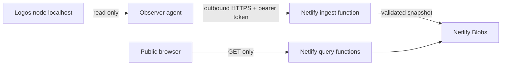

# Architecture

## Data flow

The node never accepts an Observer connection. The agent initiates one outbound request each minute.

## Trust boundaries

- The write token exists only in `/etc/logos-observer/agent.env` and is stored server-side as SHA-256.
- The node ID is not an authentication secret. It is the address of an unlisted or public dashboard.
- The server accepts a strict schema and discards every unknown property.
- The snapshot does not contain wallet keys, key IDs, config files, shell output, logs, hostname or public IP.
- The browser never receives a write token or registry token hash.
- The agent executes no start, stop, install, wallet or mutation method against Logos.

## Health model

- `critical`: node service or daemon is down, blockchain state is unavailable, or a module is crashed.
- `warning`: node is bootstrapping, has no peers, disk is at least 85%, or declared Blend is not listening.
- `healthy`: runtime, modules, connectivity and disk checks pass.
- `stale`: the last accepted snapshot is older than five minutes.

## Current limits

- Registration is intentionally account-free and rate-limited to three nodes per IP per hour.
- A node has one immutable visibility setting in v0.1.
- Public registry listing is capped at 250 nodes in v0.1.
- Historical charts and alerts are deferred until the latest-snapshot path is validated in production.
